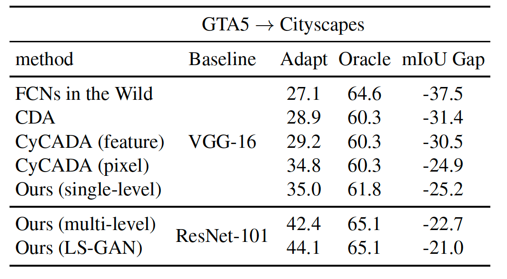

# AdaptSegNet：学习调整结构化输出空间进行语义分割

英文名：Learning to Adapt Structured Output Space for Semantic Segmentation

将语义分割从合成数据集（源域）调整到真实数据集（目标域）的方法的PaddlePaddle实现。

点击[此处](https://aistudio.baidu.com/aistudio/projectdetail/3056745?shared=1)可跳转aistudio项目，直接运行项目。

## Paper
[Learning to Adapt Structured Output Space for Semantic Segmentation](https://arxiv.org/abs/1802.10349) <br />
[Yi-Hsuan Tsai](https://sites.google.com/site/yihsuantsai/home)\*, [Wei-Chih Hung](https://hfslyc.github.io/)\*, [Samuel Schulter](https://samschulter.github.io/), [Kihyuk Sohn](https://sites.google.com/site/kihyuksml/), [Ming-Hsuan Yang](http://faculty.ucmerced.edu/mhyang/index.html) and [Manmohan Chandraker](http://cseweb.ucsd.edu/~mkchandraker/) <br />
IEEE Conference on Computer Vision and Pattern Recognition (CVPR), 2018 (**spotlight**) (\* indicates equal contribution).


## 复现指标及训练过程 

| iterations/(Batch_size=2) | meanIOU | iterations/(Batch_size=2) | meanIOU |
| :-----------------------: | :-----: | :-----------------------: | :-----: |
|          Target           |  42.35  |           Best            |  42.72  |
|           5000            |  34.29  |           10000           |  37.59  |
|           15000           |  38.84  |           20000           |  38.5   |
|           25000           |  39.07  |           30000           |  40.52  |
|           35000           |  40.22  |           40000           |  39.88  |
|           45000           |  39.88  |           50000           |  41.47  |
|           55000           |  41.13  |           60000           |  41.74  |
|           65000           |  40.98  |           70000           |  42.24  |
|           75000           |  41.47  |           80000           |  42.23  |
|           85000           |  42.11  |           90000           |  42.14  |
|           95000           |  40.72  |          100000           |  41.58  |
|          105000           |  40.82  |          110000           |  42.72  |
|          115000           |  40.96  |          120000           |  39.86  |

## Example Results


## Quantitative Reuslts



## 数据集

### 1.官网下载

* 下载源域数据集 -GTA5数据集[GTA5 Dataset](https://download.visinf.tu-darmstadt.de/data/from_games/) 。放置在 `data/GTA5` 文件夹下
* 下载目标域数据集-城市景观数据集 [Cityscapes Dataset](https://www.cityscapes-dataset.com/) ,放置在 `data/Cityscapes` 文件夹下

**注意**：

​	（1）GTA5数据集需要全部下载并且解压至同一个文件下，可通过这个[repo](https://github.com/buriedms/Utils)当中所提供的`unzips.py`脚本进行数据集的批量解压

​	（2）下载Cityscapes数据集包括gtFine和leftimg8bit两个数据集，但是仅用到gtFine的验证集部分的灰度图和在leftimg8bit中对应验证集的原始照片和训练照片，
可以通过这个[repo](https://github.com/buriedms/Utils)当中所提供的`copy_by_txt.py`脚本进行数据集的制作。详细使用图片可通过`dataset/cityscapes_list`当中`train.txt`、`val.txt`、`label.txt`文件进行查看

### 2. 通过aistudio开源数据集获取数据集

​	（1）[GTA5数据集-part1](https://aistudio.baidu.com/aistudio/datasetdetail/106349)

​	（2）[GTA5数据集-part2](https://aistudio.baidu.com/aistudio/datasetdetail/106372)

​	（3）[Cityscapes-valmini](https://aistudio.baidu.com/aistudio/datasetdetail/118666)

### 3.数据集结构目录

```
data
╠═══Citycapes
║   ╚═══data
║       ╠═══gtFine
║       ║   ╠═══test  
║       ║   ╠═══train  
║       ║   ╚═══val  
║       ╚═══leftimg8bit  
║           ╠═══test  
║           ╠═══train  
║           ╚═══val  
╚═══GTA5  
    ╠═══images  
    ╚═══labels  
```

## 预训练模型
* 原始预训练模型[链接](https://aistudio.baidu.com/aistudio/datasetdetail/119256)，可用于模型从头开始训练。
* 已训练Best模型[链接](https://aistudio.baidu.com/aistudio/datasetdetail/119256)，可用于作为继续训练的预训练模型和持续训练
* 每隔5000iteration的模型[网盘链接]()，提取码：，可用于测试每个阶段的模型效果

## 测试启动
*  下载测试模型(可选Best模型、各阶段模型、中途训练模型 ）并且放置在`model`路径下
* 使用以下代码测试模型，并且模型将会保存在`result`文件夹下（restore-from：模型文件路径）

```
python evaluate_cityscapes.py --restore-from ./model/GTA2Cityscapes_multi-ed35151c.pth 
```

* 测试结果案例：


```
0 processd
100 processd
200 processd
300 processd
400 processd
Num classes 19
===>road:	86.46
===>sidewalk:	35.96
===>building:	79.92
===>wall:	23.41
===>fence:	23.27
===>pole:	23.87
===>light:	35.24
===>sign:	14.77
===>vegetation:	83.35
===>terrain:	33.25
===>sky:	75.62
===>person:	58.49
===>rider:	27.55
===>car:	73.65
===>truck:	32.48
===>bus:	35.42
===>train:	3.85
===>motocycle:	30.05
===>bicycle:	28.11
===> mIoU: 42.35
```
* 如果您想单独对已生成的result结果计算iou，可使用例如以下代码。(thanks to the code from [VisDA Challenge](http://ai.bu.edu/visda-2017/))
```
python compute_iou.py ./data/Cityscapes/data/gtFine/val result/cityscapes
```

## 训练启动
* **重新训练**GTA5-to-Cityscapes模型 (multi-level)

```
python train_gta2cityscapes_multi.py --checkpoint-dir ./checkpoint/GTA2Cityscapes_multi \
                                     --lambda-seg 0.1 \
                                     --lambda-adv-target1 0.0002 --lambda-adv-target2 0.001
```

* **继续训练**GTA5-to-Cityscapes模型 (multi-level)

```
python train_gta2cityscapes_multi.py --checkpoint-dir ./checkpoint/GTA2Cityscapes_multi \
                                     --lambda-seg 0.1 \
                                     --lambda-adv-target1 0.0002 --lambda-adv-target2 0.001 \
                                     --start-iter latest \
                                     --continue-train 
```

- 重点参数解释

| 重点参数       | 含义                                                         |
| -------------- | ------------------------------------------------------------ |
| checkpoint-dir | 模型结果及日志保存位置                                       |
| continue-train | 是否启用持续学习策略（触发有效）                             |
| start-iter     | 持续学习开始的iter数，默认为latest，即从上次保存点开始，启动持续学习时有效 |

## Acknowledgment
Pytorch版本的原仓库：[AdaptSegNet](https://github.com/wasidennis/AdaptSegNet)。


